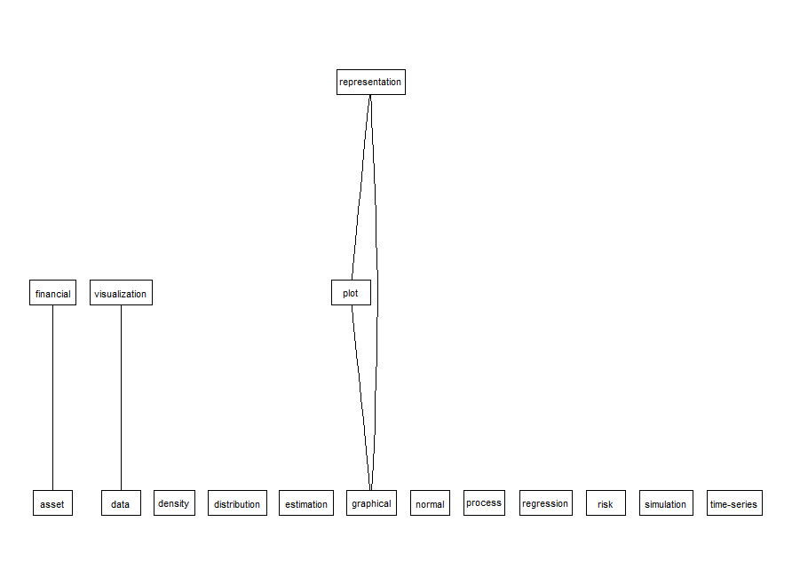
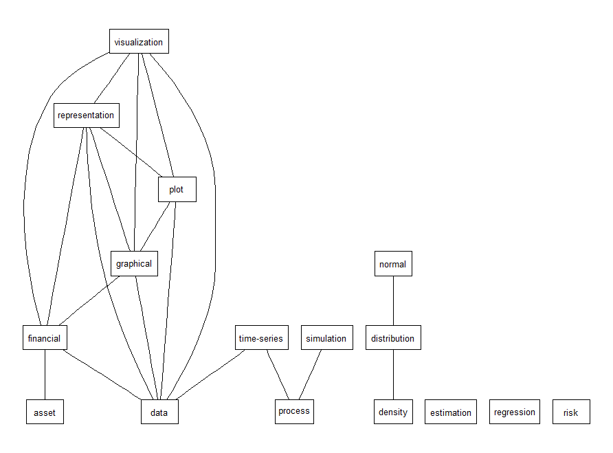
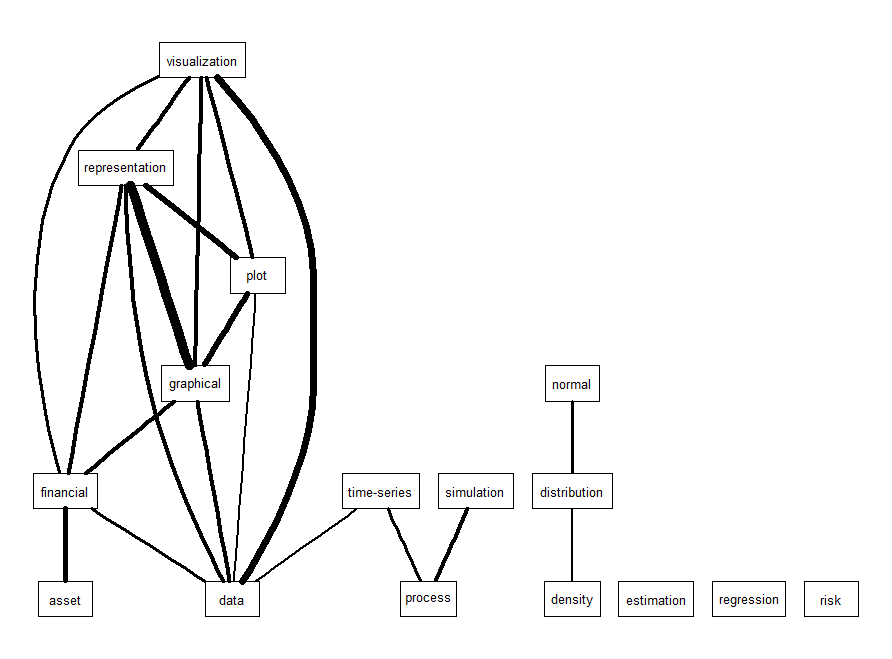
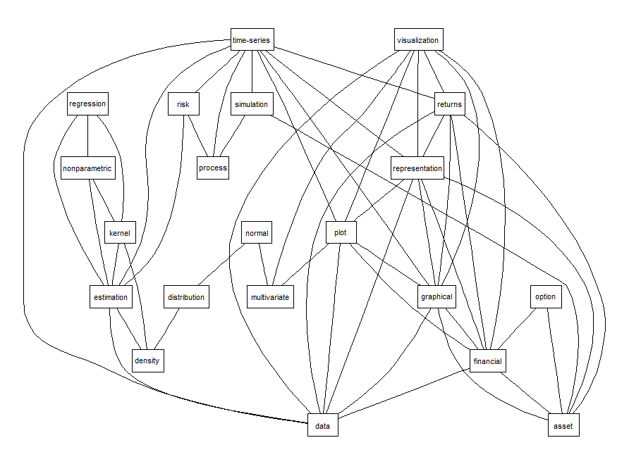
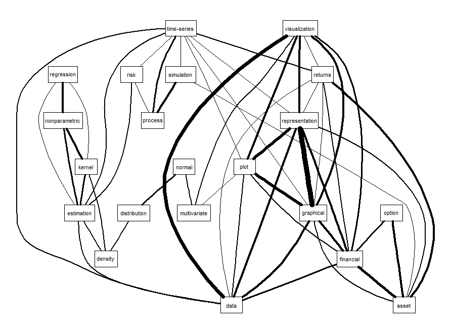
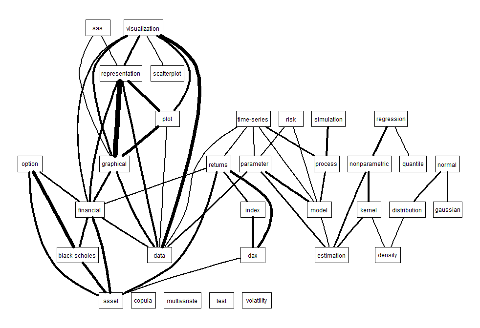
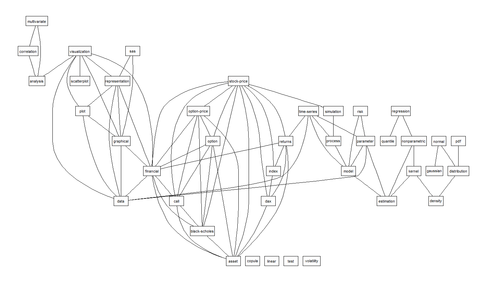
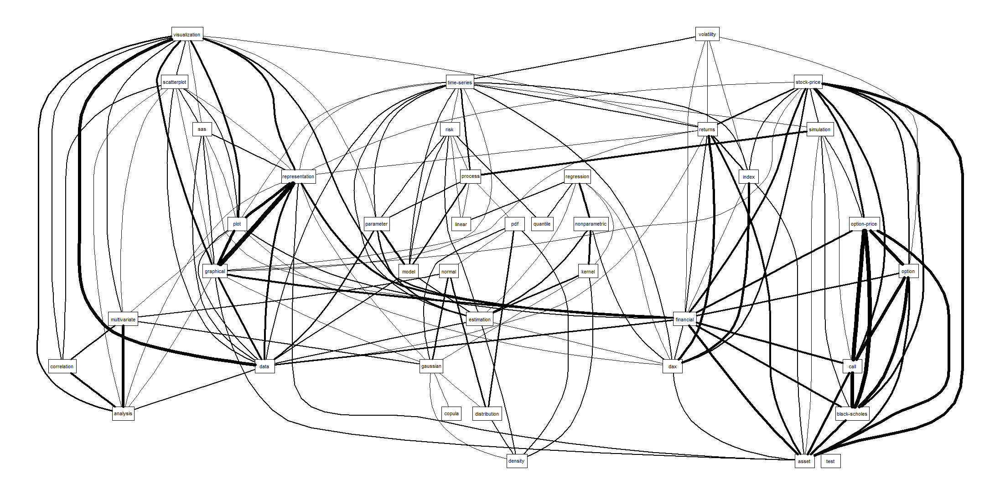
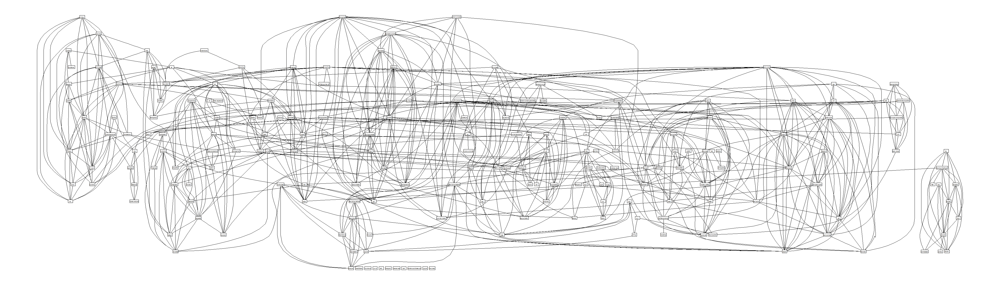

[](http://quantlet.de/)

## [](http://quantlet.de/) **yaml_TDM_CorrPlot** [](http://quantlet.de/)

```yaml

Name of Quantlet : yaml_TDM_CorrPlot

Published in : 'yamldebugger: YAML parser debugger according to the QuantNet style guide. R package
version 0.5.0.'

Description : 'Visualizes correlations between terms (keywords) of a document-term matrix via
Rgraphviz ("http://bioconductor.org/biocLite.R"). Bioconductor provides tools for the analysis and
comprehension of high-throughput genomic data. Bioconductor uses the R statistical programming
language, and is open source and open development. The correlation plots use the most frequent
words (above the given frequency bound "lowfreq") from the DTM as the nodes and include the links
among words with a correlation above the given threshold "corThreshold". The words/keywords are
taken from document-term matrix DTM which is extracted from the keywords in the YAML meta info in
Quantlets. This might help the user to get an overview of the relevance, connectedness, correlation
and frequency of the existing keywords in QuantNet.'

Keywords : 'data mining, optimization, test, standardization, preprocessing, yaml, parser,
debugger, quantnet, style guide, package, github, visualization, descriptive-statistics,
correlation, graphical representation, bioconductor'

See also : yaml_wordcloud, yaml_keyword_finder, yaml_keyword_frequency

Author : Lukas Borke

Submitted : 29.10.2016 by Lukas Borke

Example : 'Correlation graphs of keywords in different aspects and with different parameters
(lowfreq, corThreshold, weighting)'

```




















### R Code:
```r

# Clear all variables
rm(list = ls(all = TRUE))
graphics.off()

# Install and load packages
libraries = c("tm")
lapply(libraries, function(x) if (!(x %in% installed.packages())) {
  install.packages(x)
})
lapply(libraries, library, quietly = TRUE, character.only = TRUE)

## Rgraphviz must be installed for the first time,
## afterwards it is automatically loaded via tm library
# source("http://bioconductor.org/biocLite.R")
# biocLite("Rgraphviz")
# library(Rgraphviz)


(obj.names = load("yaml_DTM.RData", .GlobalEnv))

# summary of the DocumentTermMatrix containing the keywords from the YAML meta info in Quantlets
DTM

# Find frequent terms in a document-term or term-document matrix with the lower frequency bound 'lowfreq'
findFreqTerms(DTM, lowfreq = 70)

# http://artax.karlin.mff.cuni.cz/r-help/library/tm/html/plot.html
## Visualize correlations between terms of a term-document matrix. 
# The correlation plots below use the most frequent words (above the given frequency bound 'lowfreq') from the DTM as the nodes
# and include the links among words with a correlation above the given threshold 'corThreshold'

plot(DTM, terms = findFreqTerms(DTM, lowfreq = 100), corThreshold = 0.5)

plot(DTM, terms = findFreqTerms(DTM, lowfreq = 100), corThreshold = 0.2)

plot(DTM, terms = findFreqTerms(DTM, lowfreq = 100), corThreshold = 0.2, weighting = TRUE)

plot(DTM, terms = findFreqTerms(DTM, lowfreq = 70),  corThreshold = 0.1)

plot(DTM, terms = findFreqTerms(DTM, lowfreq = 70),  corThreshold = 0.1, weighting = TRUE)

plot(DTM, terms = findFreqTerms(DTM, lowfreq = 60),  corThreshold = 0.2, weighting = TRUE)

plot(DTM, terms = findFreqTerms(DTM, lowfreq = 50),  corThreshold = 0.2)

plot(DTM, terms = findFreqTerms(DTM, lowfreq = 50),  corThreshold = 0.1, weighting = TRUE)

plot(DTM, terms = findFreqTerms(DTM, lowfreq = 10),  corThreshold = 0.2)


```
