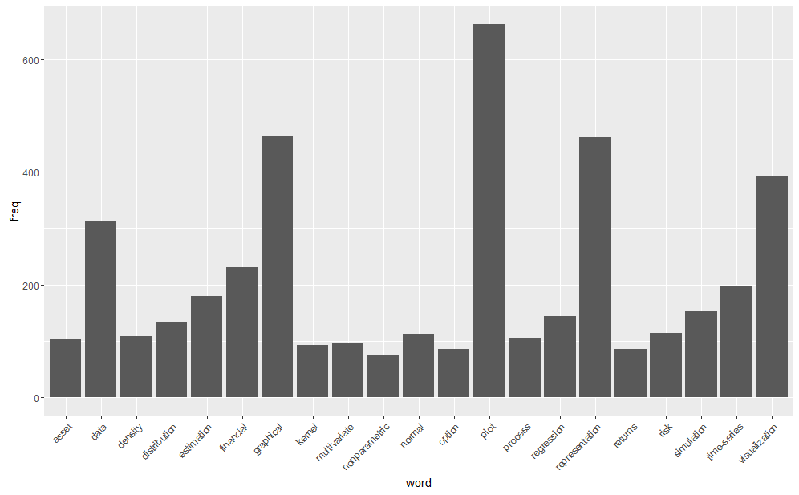
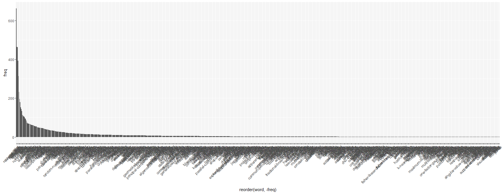
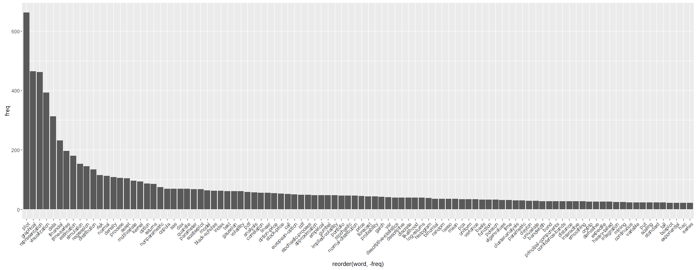

[](http://quantlet.de/)

## [](http://quantlet.de/) **yaml_keyword_frequency** [](http://quantlet.de/)

```yaml

Name of Quantlet : yaml_keyword_frequency

Published in : 'yamldebugger: YAML parser debugger according to the QuantNet style guide. R package
version 0.5.0.'

Description : 'Plots keyword distributions via ggplot : Implementation of the Grammar of Graphics
in R. The keywords are taken from document-term matrix DTM which is extracted from the keywords in
the YAML meta info in Quantlets. This might help the user to get an overview of the relevance and
frequency of the existing keywords in QuantNet.'

Keywords : 'data mining, optimization, test, standardization, preprocessing, yaml, parser,
debugger, quantnet, style guide, package, github, visualization, descriptive-statistics'

See also : yaml_TDM_CorrPlot, yaml_keyword_finder, yaml_wordcloud

Author : Lukas Borke

Submitted : 29.10.2016 by Lukas Borke

Example : Plots of keyword frequencies in 3 different aspects

```








### R Code:
```r

# Clear all variables
rm(list = ls(all = TRUE))
graphics.off()

# Install and load packages
libraries = c("tm", "ggplot2")
lapply(libraries, function(x) if (!(x %in% installed.packages())) {
  install.packages(x)
})
lapply(libraries, library, quietly = TRUE, character.only = TRUE)


(obj.names = load("yaml_DTM.RData", .GlobalEnv))

# summary of the DocumentTermMatrix containing the keywords from the YAML meta info in Quantlets
DTM

# transform DocumentTermMatrix to a standard matrix (in TDM format)
m_a = as.matrix(as.TermDocumentMatrix(DTM))
# calculate and sort term frequencies
freq = sort(rowSums(m_a), decreasing=TRUE)
# put everything in a dataframe
wf = data.frame(word = names(freq), freq = freq)


# Plot word distribution via ggplot : Implementation of the Grammar of Graphics in R

freq_min = 70
# words with frequency below freq_min will not be plotted
p <- ggplot(subset(wf, freq >= freq_min), aes(word, freq)) + geom_bar(stat="identity") + theme(axis.text.x=element_text(angle=45, hjust=1))
p

# all words sorted in descending order
ggplot(wf, aes(x = reorder(word, -freq), y = freq)) +
geom_bar(stat="identity") + theme(axis.text.x=element_text(angle=45, hjust=1))

# top 100 words wrt. the frequency
ggplot(wf[1:100,], aes(x = reorder(word, -freq), y = freq)) +
geom_bar(stat="identity") + theme(axis.text.x=element_text(angle=45, hjust=1))

```
