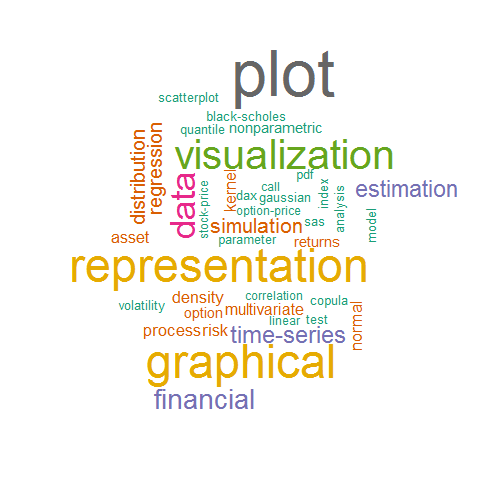
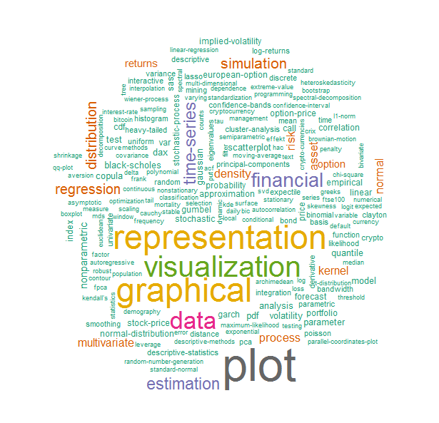
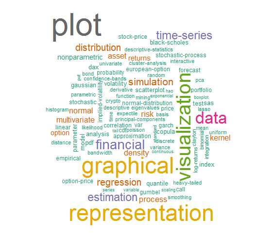
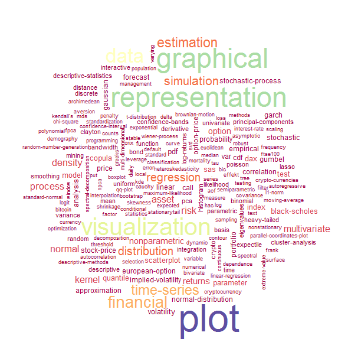
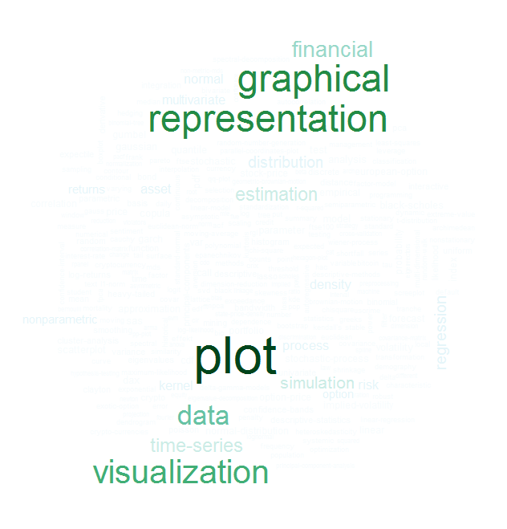
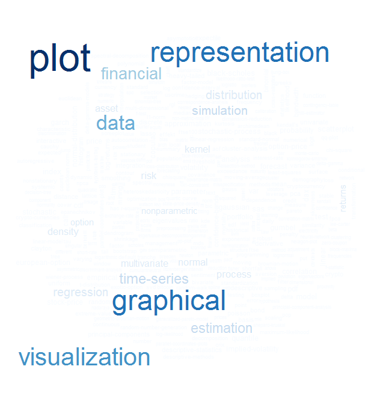
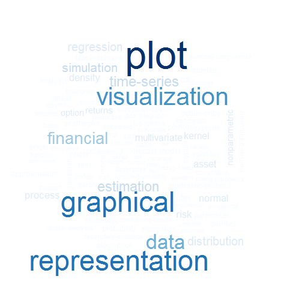

[](http://quantlet.de/)

## [](http://quantlet.de/) **yaml_wordcloud** [](http://quantlet.de/)

```yaml

Name of Quantlet : yaml_wordcloud

Published in : 'yamldebugger: YAML parser debugger according to the QuantNet style guide. R package
version 0.5.0.'

Description : 'Plots the wordcloud of the keywords in QuantNet. The keywords are taken from
document-term matrix DTM which is extracted from the keywords in the YAML meta info in Quantlets.
This might help the user to get an overview of the relevance and frequency of the existing keywords
in QuantNet.'

Keywords : 'data mining, optimization, test, standardization, preprocessing, yaml, parser,
debugger, quantnet, style guide, package, github, visualization, descriptive-statistics, wordcloud'

See also : yaml_TDM_CorrPlot, yaml_keyword_finder, yaml_keyword_frequency

Author : Lukas Borke

Submitted : 29.10.2016 by Lukas Borke

Example : 'Plots of keyword wordclouds in different aspects and with different parameters
(frequency, colors etc.)'

```

















### R Code:
```r

# Clear all variables
rm(list = ls(all = TRUE))
graphics.off()

# Install and load packages
libraries = c("tm", "wordcloud")
lapply(libraries, function(x) if (!(x %in% installed.packages())) {
  install.packages(x)
})
lapply(libraries, library, quietly = TRUE, character.only = TRUE)


(obj.names = load("yaml_DTM.RData", .GlobalEnv))

# summary of the DocumentTermMatrix containing the keywords from the YAML meta info in Quantlets
DTM

# transform DocumentTermMatrix to a standard matrix (in TDM format)
m_a = as.matrix(as.TermDocumentMatrix(DTM))
# calculate and sort term frequencies
freq = sort(rowSums(m_a), decreasing=TRUE)
# put everything in a dataframe
wf = data.frame(word = names(freq), freq = freq)

# Wordcloud outputs
set.seed(142)
# words with frequency below min.freq will not be plotted
wordcloud(names(freq), freq, min.freq=50, colors=brewer.pal(8, "Dark2"))

wordcloud(names(freq), freq, min.freq=10, colors=brewer.pal(8, "Dark2"))

# all words
wordcloud(names(freq), freq, colors=brewer.pal(8, "Dark2"))

# max.words : maximum number of words to be plotted. Least frequent terms dropped
wordcloud(names(freq), freq, max.words=100, colors=brewer.pal(8, "Dark2"))

wordcloud(names(freq), freq, max.words=200, colors=brewer.pal(11, "Spectral"))

wordcloud(names(freq), freq, max.words=300, colors=brewer.pal(9, "BuGn"))

wordcloud(names(freq), freq, max.words=400, colors=brewer.pal(9, "Blues"))

wordcloud(names(freq), freq, max.words=100, colors=brewer.pal(9, "Blues"))

```
